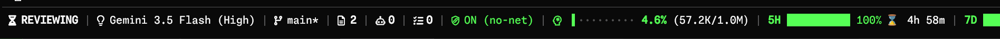

# agy-statusline



Antigravity CLI 向けの高度なステータスラインプラグイン。オリジナルの [antigravity-cli-statusline](https://github.com/weby-homelab/antigravity-cli-statusline) を Rust に移植し、Nerd Font アイコン、クォータバー表示、クロスプラットフォーム対応を強化しました。

## レイアウト

画面幅による表示の切り替えやトリミング処理を廃止し、常にすべての詳細情報を左詰めで一列に表示するシンプルなレイアウトに統一されています。

## 機能

- **シンプルレイアウト** — 常にすべての情報（モデル名、VCS、ステータス、クォータ等）を1行でスッキリ表示
- **Nerd Font アイコン** — デフォルトで Nerd Font アイコン使用、`--classic` で ASCII 互換モード
- **高精度バー表示** — コンテキスト使用率や API クォータ残量を10セグメントで表示。1/8ステップ（1.25%刻み）の滑らかな縦分割ブロック描画に対応し、残り割合に応じた警告色（赤・黄・緑）で色分け
- **リセット時間表示** — クォータリセットまでの残り時間を表示（例: `⌛️ 3h 30m`）
- **Git 直接取得** — JSON ではなく `git` コマンドからリアルタイムのブランチ・変更状態を取得
- **トークン使用量** — 入出力トークンを人間可読形式（K/M）で表示
- **サンドボックス状態** — ON (net) / ON (no-net) / OFF

## インストール

### ビルド済みバイナリ

[Releases](https://github.com/cwatanab/agy-statusline/releases) から各プラットフォームのバイナリをダウンロードしてください：

- `statusline-windows-x86_64.exe` — Windows (x64)
- `statusline-linux-x86_64` — Linux (x64)
- `statusline-linux-arm64` — Linux (ARM64)

### ソースからビルド

```bash
git clone https://github.com/cwatanab/agy-statusline.git
cd agy-statusline
cargo build --release
```

### 設定

`~/.agy/settings.json` に以下を追加：

```json
{
  "statusLine": {
    "type": "",
    "command": "/path/to/statusline",
    "enabled": true
  }
}
```

クラシックモード（Nerd Font 不要）を使用する場合：

```json
{
  "statusLine": {
    "type": "",
    "command": "/path/to/statusline --classic",
    "enabled": true
  }
}
```

## コマンドラインオプション

| オプション | 説明 |
|---|---|
| `--classic` | ASCII 互換モード（Nerd Font 不要） |
| `--no-nerdfont` | `--classic` のエイリアス |
| `--compatibility` | `--classic` のエイリアス |

## 謝辞

このプロジェクトは [weby-homelab/antigravity-cli-statusline](https://github.com/weby-homelab/antigravity-cli-statusline) をベースにしています。
オリジナルの作者である Weby Homelab に感謝します。

> Built in Ukraine under air raid sirens & blackouts ⚡
> © 2026 Weby Homelab
