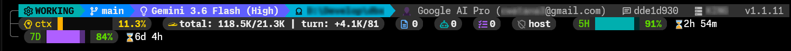

# agy-statusline



Antigravity CLI 向けの超高速・高密度ステータスラインプラグイン。
オリジナルの [antigravity-cli-statusline](https://github.com/weby-homelab/antigravity-cli-statusline) を Rust に移植し、ゼロコピーパース、シングルバッファレンダリング、スマート動的行パッキング、Nerd Font アイコン、システムテレメトリ、クロスプラットフォーム対応を強化しました。

---

## 主な特徴

- ⚡ **超高速・ゼロ依存** — 外部 crate なし（標準ライブラリのみ）。ゼロコピーパースと単一バッファ描画によりミリ秒未満で即時レンダリング。
- 📦 **スマート動的行パッキング** — 端末幅（Columns）に応じてテレメトリバッジを行折り返しなしで綺麗に枠組み（`╭─`, `├─`, `╰─`）へ自動整列。
- 🎨 **Powerline & Nerd Font** — 洗練されたカラーグラデーションと Powerline セグメント。`--classic` で ASCII 互換モードにも対応。
- 📊 **高精度クォータ & コンテキストバー** — 1/8 ステップ（1.25% 刻み）の縦分割ブロック描画と残量に応じた警告色（緑・黄・赤）。5時間/7日間クォータのリセット残り時間も表示。
- 🔍 **リアルタイム VCS 連携** — `git` コマンドから直接ブランチ名および未コミット変更（ダーティ状態 `*`）を取得。
- 💻 **システム & エージェントテレメトリ** — RAM 使用率、CPU 負荷、トークン消費量（Total / Turn）、アーティファクト数、サブエージェント数、タスク数、サンドボックス状態、電源/バッテリー残量を一覧表示。

---

## 表示項目

### 1行目: Powerline セグメント
| 項目 | Nerd Font | Classic | 説明 |
|---|:---:|:---:|---|
| **エージェント状態** | `` / `󰟷` / `󰐣` / `󰐥` | `●` / `◆` / `⚙` / `🔧` | READY, THINKING, WORKING, TOOL |
| **Git ブランチ** | `` | `╱` | ブランチ名（変更がある場合は赤背景 + `*`） |
| **モデル名** | `` | - | 現在アクティブな LLM モデル名 |
| **カレントディレクトリ** | `` | `╱` | 作業ディレクトリパス（短縮表示） |
| **ユーザー・プラン** | `👤` | - | アカウント種別および登録メールアドレス（幅130以上） |
| **会話 ID** | `` | `╱` | セッション ID 接頭辞（幅80以上） |
| **ホスト情報** | `` | - | OS・ホスト名・CPUコア数（幅110以上） |
| **バージョン** | - | - | プラグインバージョン（幅120以上） |

### 2行目以降: テレメトリバッジ（動的パッキング）
| バッジ | 説明 |
|---|---|
| **Context Bar** | コンテキストウィンドウ使用率バー（10/20セグメント、警告色付き） |
| **Tokens** | 入出力トークン合計（`total: in/out`）および現ターンの増分（`turn: +in/+out`） |
| **System** | ホスト RAM 使用率（%）および 1 分間ロードアベレージ（CPU 負荷） |
| **Artifacts** | 生成されたアクティブな成果物・ファイルの数 |
| **Subagents** | 起動中のサブエージェント数 |
| **Tasks** | バックグラウンド実行中のタスク数 |
| **Sandbox** | サンドボックス実行状態（`net-on` / `net-off` / `host`） |
| **Quotas (5H / 7D)** | 5時間および7日間の API クォータ残量バーとリセット残り時間（`⌛️`） |
| **Power** | AC 電源接続（`AC`）またはバッテリー残量（`BAT %`） |

---

## インストール

### ビルド済みバイナリ

[Releases](https://github.com/cwatanab/agy-statusline/releases) からお使いのプラットフォームに合わせたバイナリをダウンロードしてください：

- `statusline-windows-x86_64.exe` — Windows (x64)
- `statusline-linux-x86_64` — Linux (x64)
- `statusline-linux-arm64` — Linux (ARM64)
- `statusline-macos-x86_64` — macOS (Intel)
- `statusline-macos-arm64` — macOS (Apple Silicon)

### ソースからビルド

```bash
git clone https://github.com/cwatanab/agy-statusline.git
cd agy-statusline
cargo build --release
```

---

## 設定

`~/.agy/settings.json`（または Antigravity CLI の設定ファイル）に以下を追加します：

```json
{
  "statusLine": {
    "type": "",
    "command": "/path/to/statusline",
    "enabled": true
  }
}
```

### クラシックモード（Nerd Font 不要）

Nerd Font をインストールしていない環境では、`--classic` オプションを指定します：

```json
{
  "statusLine": {
    "type": "",
    "command": "/path/to/statusline --classic",
    "enabled": true
  }
}
```

---

## コマンドラインオプション

| オプション | 説明 |
|---|---|
| `-v`, `--version` | バージョン情報を表示して終了 |
| `-l`, `--legend`, `legend` | アイコンとコンポーネントの凡例を表示して終了 |
| `--classic`, `--no-nerdfont`, `--compatibility` | ASCII / ANSI 互換モードで描画（Nerd Font 不要） |
| `--compact` | 端末幅を強制的に 89 桁としてレンダリング |
| `--medium` | 端末幅を強制的に 120 桁としてレンダリング |
| `--medium-wide` | 端末幅を強制的に 150 桁としてレンダリング |

---

## 謝辞

このプロジェクトは [weby-homelab/antigravity-cli-statusline](https://github.com/weby-homelab/antigravity-cli-statusline) をベースに設計・Rust 再実装されたものです。
オリジナルの作者である Weby Homelab に深く感謝いたします。

> Built in Ukraine under air raid sirens & blackouts ⚡  
> © 2026 Weby Homelab
